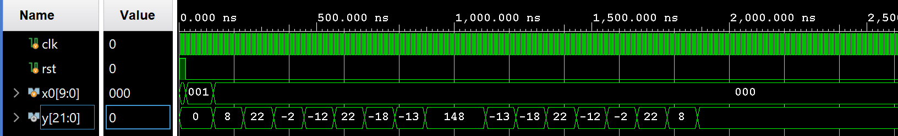
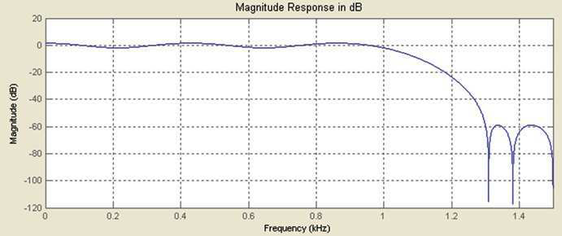

# FIR Filter Design Using Distributed Arithmetic (DA)

A **16-Tap Low Pass FIR Filter** implemented in **Verilog HDL** using the **Distributed Arithmetic (DA)** technique. This architecture replaces conventional multipliers with Look-Up Tables (LUTs), shift operations, and accumulation, resulting in a hardware-efficient and low-power implementation suitable for FPGA-based DSP applications.

---

## 📌 Project Overview

Finite Impulse Response (FIR) filters are fundamental building blocks in Digital Signal Processing (DSP). Conventional FIR filters require one multiplier per tap, which increases hardware complexity, area, and power consumption.

Distributed Arithmetic (DA) eliminates hardware multipliers by storing precomputed coefficient sums in LUTs and performing filtering using bit-serial processing with shift-and-accumulate operations. This significantly reduces FPGA resource utilization while maintaining filtering performance.

This project implements a **16-Tap Low Pass FIR Filter** using Distributed Arithmetic and validates the design through simulation and FPGA synthesis.

---

## ✨ Features

- 16-Tap Low Pass FIR Filter
- Multiplier-less Distributed Arithmetic architecture
- LUT-based coefficient storage
- Bit-serial Shift-and-Accumulate implementation
- Verilog HDL implementation
- FPGA synthesizable
- Area and power efficient design

---

## 🏗️ Architecture

The filter architecture consists of:

- 16-stage input shift register
- Four 16 × 13-bit Look-Up Tables (LUTs)
- Shift-and-Accumulate (SAC) unit
- Adder
- Output register

---

## ⚙️ Working Principle

1. Input samples are shifted into a 16-stage register.
2. During each clock cycle, one bit from every input sample is processed.
3. These bits form addresses for the LUTs.
4. The LUTs output precomputed partial sums.
5. Partial sums are shifted according to the current bit position.
6. The accumulator combines the shifted values.
7. After processing all input bits, the final filtered output is produced.

This architecture completely eliminates hardware multipliers, making it highly suitable for FPGA implementation.

---

## 📊 Filter Specifications

| Parameter | Value |
|-----------|-------|
| Filter Type | Low Pass FIR |
| Number of Taps | 16 |
| Input Width | 10-bit Signed |
| Output Width | 22-bit Signed |
| Architecture | Distributed Arithmetic |
| LUT Size | 16 × 13-bit |
| HDL | Verilog |
| FPGA Tool | Xilinx Vivado |

---

## 📑 Filter Coefficients

| Tap | Coefficient | Tap | Coefficient |
|-----|------------|-----|------------|
| h(0) | 0.0328 | h(8) | 0.5763 |
| h(1) | 0.0816 | h(9) | -0.0550 |
| h(2) | -0.0065 | h(10) | -0.0694 |
| h(3) | -0.0047 | h(11) | 0.0847 |
| h(4) | 0.0847 | h(12) | -0.0047 |
| h(5) | -0.0694 | h(13) | -0.0065 |
| h(6) | -0.0550 | h(14) | 0.0816 |
| h(7) | 0.5763 | h(15) | 0.0328 |

---

## 📈 Simulation Result

The simulation waveform verifies that the DA-based FIR filter correctly processes the input sequence and produces the expected filtered output.

---

## 📉 Frequency Response

The magnitude response confirms the low-pass characteristics of the designed FIR filter, exhibiting a flat passband and strong attenuation in the stopband.

---

## 🛠️ FPGA Synthesis Results

The design was successfully synthesized using **Xilinx Vivado**.

### Hardware Utilization

| Resource | Utilization | Available | Utilization (%) |
|----------|------------:|----------:|----------------:|
| LUT | **179** | 134600 | **0.13%** |
| Flip-Flops | **209** | 269200 | **0.08%** |
| I/O Pins | **34** | 400 | **8.50%** |

**Area Comparison:** The proposed DA FIR filter reduced LUT utilization from **496** to **179 LUTs**, achieving approximately **64% lower area utilization** than a conventional FIR implementation.

### Power Analysis

| Parameter | Value |
|-----------|------:|
| Dynamic Power | **7.316 W** |
| Static Power | **0.158 W** |
| Total On-Chip Power | **7.474 W** |

**Power Comparison:** The proposed DA architecture reduced total on-chip power from **40.13 W** to **7.47 W**, corresponding to an **81% reduction in power consumption**.

---

## 🚀 Advantages

- Eliminates hardware multipliers
- Approximately **64% lower LUT utilization**
- Approximately **81% lower on-chip power**
- FPGA-friendly implementation
- Reduced hardware complexity
- Efficient LUT utilization
- Suitable for fixed-coefficient DSP applications

---

## 🧪 Tools Used

- Verilog HDL
- Xilinx Vivado
- ModelSim
- MATLAB

---

## 📌 Conclusion

A **16-Tap Low Pass FIR Filter** based on the **Distributed Arithmetic (DA)** technique was successfully designed and implemented in Verilog HDL. By replacing conventional multipliers with LUTs and shift-and-accumulate operations, the proposed architecture achieved significant hardware optimization. FPGA synthesis demonstrated a **64% reduction in LUT utilization** and an **81% reduction in total on-chip power** compared to a conventional FIR implementation, making the design highly suitable for FPGA-based low-power DSP applications.
